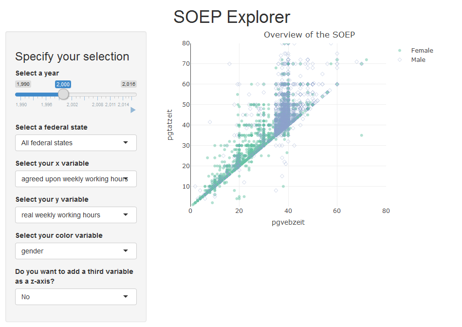
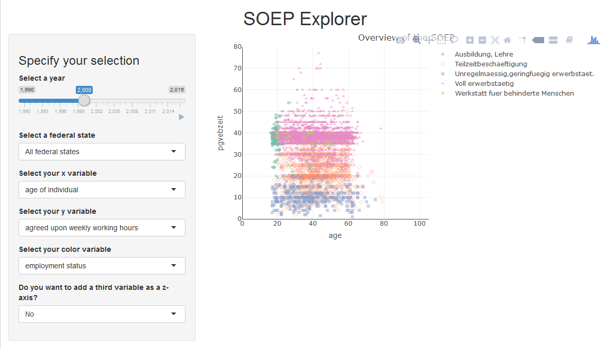
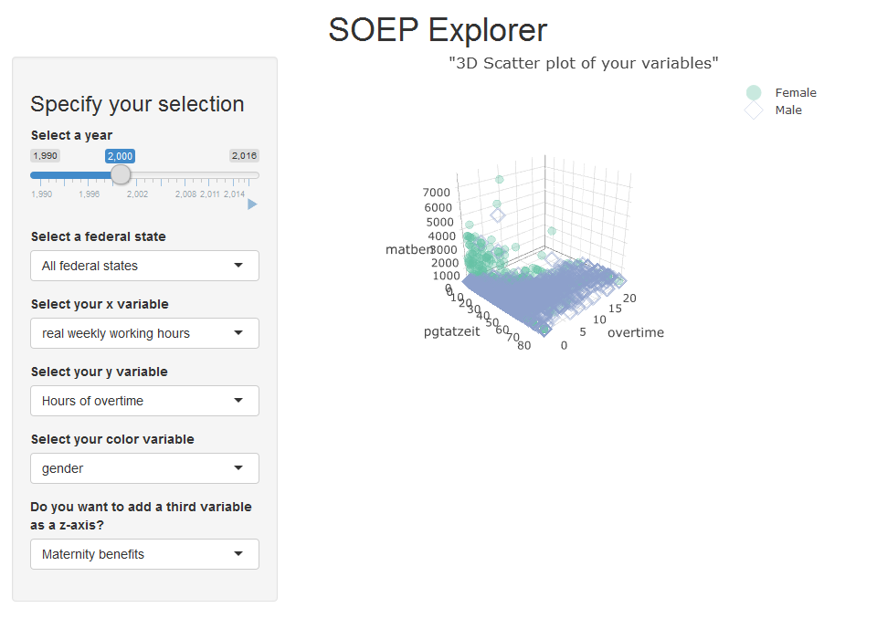

[](http://quantlet.de/)

## [](http://quantlet.de/) **SPL_SOEPExplorer** [](http://quantlet.de/)

```yaml
Name of Quantlet: SPL_SOEPExplorer

Published in: Statistical programming languages - Student Project on "Visualizing Panel Data"

Description: Interactive graph used for explorative plotting of panel or time series data with Shiny.

Keywords: graph, SOEP, Panel Data, shiny, time series, explorative

Author: Clara Hoffmann, Antonia Scherz, Veronika Belcheva

Submitted: Sun, August 12 2018

```
# SOEP Explorer

The SOEP Explorer is an interactive graph used to get playful and intuitive access to Germany's largest household panel data set with the Shiny package.
It plots up to four variables (x,y,z + color/shape variable). It also provides an option to subset to federal state level. 



### Packages

```r
# load packages
if (!require("pacman")) 
  install.packages("pacman"); library("pacman") 

p_load("magrittr", 
       "dplyr", 
       "shiny",
       "plotly",
       "DT",
       "haven")

```

## Helper Function to Find Column Number
```r
FindColNumber <- function(df,input){
  as.numeric(which(colnames(df)==input))
}
```

### User Interface

In the user interface we determine the input choices and the output to be presented

```r
UserInterfaceSOEP <- fluidPage(
  titlePanel(title = h1("SOEP Explorer", 
                        align = "center")),
  #layout with main area and side bar
  sidebarLayout( position = "left",
                 sidebarPanel(
                   h3("Specify your selection"),
                   # slide bar + animate
                   sliderInput("year", 
                               "Select a year", 
                               min = 1990, 
                               max = 2016, 
                               value = 2000, 
                               step = 1, 
                               animate = T),
                 ...
                 mainPanel(
                   plotlyOutput("myhist")
                 )
  )
)
```

### Server Function

The server function converts input variables to output variables. All code should be written within this framework:

```r
ServerSOEP <- function(input, output){#
       ...
}
```

From the user input choices we get the relevant row and column numbers in the main data frame, using the FindColNumber function specified earlier. For the values on the x axis, we first get the column number...

```r
colm1 <- reactive({
    FindColNumber(data, input$var1)
  })
```

.. then the row number, which can change depending on whether the user only chooses one federal state.


```r
  row <- reactive({
    cond <- as.numeric(!(input$state == "All"))+1
    switch( cond,
            as.numeric(which(data$syear == input$year)),
            as.numeric(which(
              data$syear == input$year 
              & data$state==input$state)))
  })
```

Then we use the rows and columns to retrieve the relevant data from the data frame:

```r
  x <- reactive({
    data[row(), colm1()]
  })
```
We do the same for the y-axis and z-axis as well as the color and shape data.
Lastly we define the plot output, for 2D:

```r
plot_ly(x = x(), 
              y = y()) %>%
        add_markers( alpha = 0.5,
                     #size = 0.1,
                     color = color(), 
                     symbol = color(),
                     symbols = c('circle',"diamond-open",
                                 "square", "triangle-up-dot",
                                 "x-dot", "triangle-down")
                     )%>%
        layout(title = 'Overview of the SOEP',
               xaxis = list(title = input$var1,
                            zeroline = TRUE,
                            range = range1()),
               yaxis = list(title = input$var2,
                            range = range2()))
```                           


or 3D:
```r
plot_ly() %>%
        add_trace(x = x(),
                  y = y(),
                  z = z(), 
                  type = "scatter3d", 
                  mode = "markers",
                  color = color(),
                  opacity = 0.5,
                  size = 0.1,
                  symbol = color(),
                  symbols = c('circle',"diamond-open",
                              "square", "triangle-up-dot",
                              "x-dot", "triangle-down")) %>%
        layout(title = '"3D Scatter plot of your variables"',
               scene = list(xaxis = list(title = input$var1),
                            yaxis = list(title = input$var2),
                            zaxis = list(title = input$var3),
                            camera = list(
                              eye = list(
                                x = 2, 
                                y = -2, 
                                z = 1.25), 
                              zoom = 5),
                            showlegend = TRUE,
                            legend = list(orientation = 'h'))) 
```


Lastly we run the app:

```r
app <-  shinyApp(ui = UserInterfaceSOEP,
         server = ServerSOEP)
runApp(app)
```

## Authors

* **Antonia Scherz, Veronika Belcheva, Clara Hoffmann - Humboldt University** -
See also the list of [contributors](https://github.com/your/project/contributors) who participated in this project.

## Acknowledgments

* [Abhinav Agrawal](https://www.youtube.com/channel/UCbck9jjLpwj7U6HHNps_9Gw) has a great introduction to the Shiny package on his Youtube channel 
